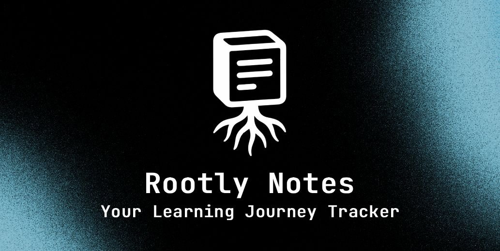

<p align="center">
  
</p>

<p align="center">
  
  
  
  
  
  
</p>

<p align="center">
  
  
  <a href="https://vercel.com/new" target="_blank"></a>
</p>

<p align="center">
  <a href="https://rootly-notes-app.vercel.app/" target="_blank" rel="noopener noreferrer">
    
  </a>
</p>

---

## Overview

Rootly Notes helps you track what you learn. You can organize courses, save notes, and see your progress over time. It works with Supabase for cloud sync or LocalStorage for offline use. Your data is private and secure.

---

## ✨ Features

- **Dual Storage Modes**: Use Supabase for cloud sync or LocalStorage for offline use.
- **Visual Analytics**: See charts for your understanding, study time, mood, and course progress over the last 90 days.
- **Smart Review**: Practice what you learned with a quiz mode. Get a detailed summary of your session with accuracy and improvement stats.
- **Notes Management**: Save Q&A notes with code snippets. Filter by course or understanding level. Flag important notes.
- **Course Tracking**: Keep your courses organized with instructor names and links.
- **Daily Logging**: Track how many hours you study and your mood each day.
- **Responsive Design**: Works great on mobile and desktop. Includes dark mode and custom colors.

## 🧭 Routes

| Path                      | Description                   |
| ------------------------- | ----------------------------- |
| `/`                       | Public landing page           |
| `/login`                  | Sign in with Google or GitHub |
| `/auth/callback`          | Supabase OAuth callback       |
| `/overview`               | Dashboard with charts         |
| `/notes`                  | View and manage notes         |
| `/courses`                | Manage your courses           |
| `/daily-tracking`         | Log study time and mood       |
| `/review`                 | Practice session              |
| `/about`, `/how-it-works` | Info pages                    |

---

## 🧱 Tech Stack

- **Framework:** Next.js 15 (App Router)
- **UI:** React 19, TypeScript, Tailwind CSS v4
- **Components:** Radix UI, Shadcn UI
- **Charts:** Recharts
- **Notifications:** Sonner
- **Backend:** Supabase (PostgreSQL, Auth, RLS)
- **Icons:** Lucide React
- **Fonts:** Geist Sans/Mono
- **Theming:** next-themes

---

## 📦 Data Model

The app uses a secure schema where each user only sees their own data:

- `profiles`: User details like name and avatar.
- `courses`: Your courses with links and topics.
- `notes`: Your Q&A notes with code snippets and understanding levels (1 to 5).
- `daily_entries`: Your daily study logs with time and mood.

All tables use Row Level Security (RLS) to keep data safe.

---

## 🧭 Project Structure

```
rootly-notes-app/
├─ app/                # Pages and routes
├─ components/         # UI components
├─ hooks/              # Custom hooks
├─ lib/                # Utilities and types
├─ public/             # Static files
├─ scripts/            # Database scripts
├─ styles/             # Global styles
└─ ...
```

---

## 🌗 Theming & UX

- Switch between dark and light mode.
- Choose your favorite accent color.
- Clean and easy to read text.
- Smooth animations and transitions.

---

## 📈 Analytics & Exports

- View charts for your progress on the dashboard.
- Export your notes to JSON or CSV from the notes page.

---

## 🤝 How to Contribute

1. Fork and clone this repo.
2. Install dependencies and set up your environment variables.
3. Run the SQL scripts in Supabase to set up the database.
4. Enable Google and GitHub auth in Supabase.
5. Start the dev server and make your changes.
6. Open a Pull Request with screenshots of your changes.

---

## 📜 License

This project is licensed under the MIT License. See the [LICENSE](LICENSE) file for details.

---

## 📞 Support

If you have any issues:

1. Search existing [Issues](https://github.com/mo0hamed-shoaib/rootly-notes-app/issues)
2. Create a [new issue](https://github.com/mo0hamed-shoaib/rootly-notes-app/issues/new/choose)

---

<p align="center">Made with ❤️ for learners everywhere</p>
